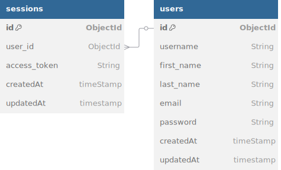

# TeLoCobro

## Base de datos



## Primeros pasos

1. Clona el repositorio a tu máquina local:

   ```sh
   git clone https://github.com/iamcarlosdaniel/TeLoCobro
   ```

2. Navega al directorio del proyecto:

   ```sh
   cd TeLoCobro
   ```

3. Instala las dependencias necesarias:

   ```sh
   npm install
   ```

4. Inicia el servidor de desarrollo:

   ```sh
   npm run dev
   ```

> El proyecto está configurado para ejecutarse en el puerto 3000, así que asegúrate de que este puerto esté disponible para su uso y verifica la conexión a la base de datos. Puedes encontrar estas y otras opciones en las variables de entorno del proyecto ubicadas en el archivo .env.
